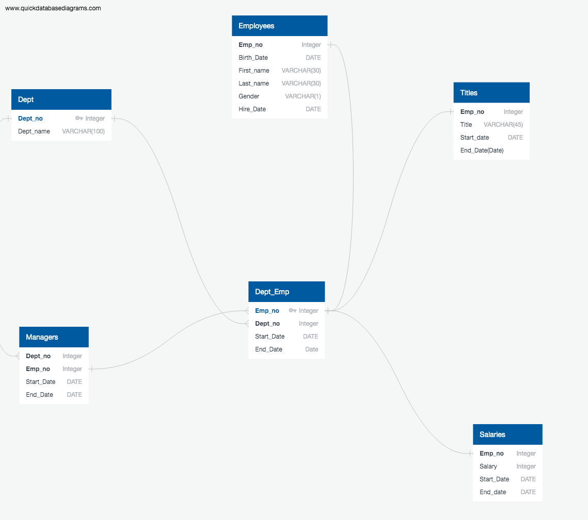

# Employee queries

In this assignment, I designed the tables to hold data in the CSVs files, imported the CSVs into a SQL database, and performed the below:

1. Data Modeling
- Inspected the CSVs and sketch out an ERD of the tables. 

2. Data Engineering

- Used the information I had to create a table schema for each of the six CSV files.

- Imported each CSV file into the corresponding SQL table.

3. Data Analysis

Completed the below:

- Listed the following details of each employee: employee number, last name, first name, gender, and salary.

- Listed employees who were hired in 1986.

- Listed the manager of each department with the following information: department number, department name, the manager's employee number, last name, first name, and start and end employment dates.

- Listed the department of each employee with the following information: employee number, last name, first name, and department name.

- Listed all employees whose first name is "Hercules" and last names begin with "B."

- Listed all employees in the Sales department, including their employee number, last name, first name, and department name.

- Listed all employees in the Sales and Development departments, including their employee number, last name, first name, and department name.

- In descending order, listed the frequency count of employee last names, i.e., how many employees share each last name.

Below is a snapshot of the Entity Relationship Diagram (ERD)

